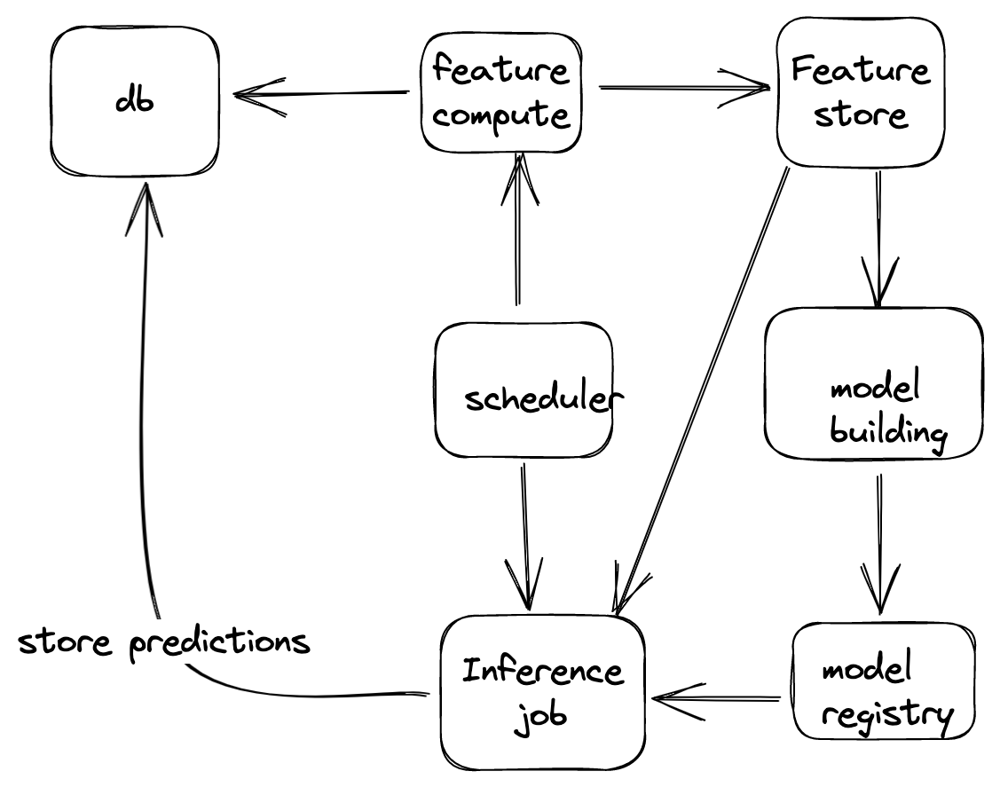

# Design a system to predict if the user will churn or not

*Interviewer*: We are an ecommerce company. Design a system to predict if the user will churn or not.

*Vee* okay. So we have to design a system to predict if the user will churn or not. Can you tell me more about the problem?

*Interviewer*: We have a ecommerce platform. We have users who buy products from our platform. We want to predict if the user will churn or not. Meaning user will stop using our platform and will not buy products from our platform. Anything more specific you want to know?

*Vee*: Yes. How do we define churn? or I have to define churn?

*Interviewer*: Thats a good question. We define churn as the user who has not bought anything from our platform in last 30 days. Although, you can come up with your own definition of churn. 

*Vee*: Okay. So we have to predict if the user will buy anything from our platform in next 30 days or not. I have few more questions:

- Do you need this as batch system or real time system?
- Do you need the probabilities or binary outcome?
- What should be final output you will need? userid and churn probability in next 30 days? 

*Interviewer*: Lets go with batch system. We will talk about real time system later.

*Vee*: Okay. I think I have enough information to start with.

*Interviewer*: Okay. Lets start with what factors you will consider to predict if the user will churn or not.

*Vee*: I will consider following factors:

- User demographics
- User past purchase history
- User past search history
- Average time spent on the platform in last 7 days/15 days/30 days
- Inactive days since last order
- Average gap days between orders 
- Many more..

*Interviewer*: Okay. So you have listed down the factors. How will you use these factors to predict if the user will churn or not? 

*Vee*: I will use these factors as features and will build a model. I will use supervised learning to build the model where the target is binary flag. 
y=1 if user did not buy anything in the next 30 days

*Interviewer*: Okay. So you will build a model. How will you evaluate the model?

*Vee*: I will use AUC as the evaluation metric. I will use 70-30 split to train and test the model. I will use 5 fold cross validation to train the model. I will use grid search to find the best hyperparameters. I will use random forest as the model.
Do you want me to go deeper or give you the basic design of the system?

*Interviewer*: Lets build the system first. We will go deeper later.

*Vee* Give me 5 minutes for the basic overview of system. Few assumptions I am making here:

- we have data available for last 2-3 years and data is big
- Going ahead with batch system and not real time system.
- 

Here is the basic system:

- I will schedule a job to run every day to create features for the model. Scheduler will help me setup the alert if the job fails and monitoring setup. This job will store the features into feature store or database or any file store we want to use. 
- Model building : We will train a model here. We will use 70-30 split to train and test the model. We will use 5 fold cross validation to train the model. We will use grid search to find the best hyperparameters. We will use random forest as the model. 
- Model Registry: We will store the model in model store. We can use MLflow here for versioning and storing other info. 
- Inference: Set up daily inference job which fetches features from feature store and predict the probability of user churn and store these predictions in database. 

*Interviewer*: Okay. So you have given me the basic overview of the system. Lets go deeper into each component. Lets start with feature store. How will you design feature store?

